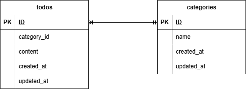

# Todoアプリ

Todo管理アプリです。

Todoを作成し、管理することができます。カテゴリ一覧ページから、カテゴリを追加し、Todoをカテゴリ分けすることも可能です。Todo検索機能を使い、入力したTodoをTodo名・カテゴリで検索することもできます。また、作成したTodoを更新・削除することも可能です。

## 環境構築

####リポジトリをクローン

```
git clone git@github.com:ikemi-yuki/todo.git
```

#### Laravelのビルド

```
docker-compose up -d --build
```

#### Laravelパッケージのダウンロード

```
docker-compose exec php bash
```

```
composer install
```

#### .envファイルの作成

```
cp .env.example .env
```

#### .envファイルの修正

```
DB_HOST=mysql

DB_DATABASE=laravel_db

DB_USERNAME=laravel_user

DB_PASSWORD=laravel_pass
```

#### キー生成

```
php artisan key:generate
```

#### マイグレーションを実行

```
php artisan migrate
```

## 使用技術（実行環境）

フレームワーク：Laravel

言語：HTML CSS PHP

Webサーバー：Nginx

データベース：MySQL

## ER図



## URL

アプリケーション：http://localhost/

phpMyAdmin：http://localhost:8080/
